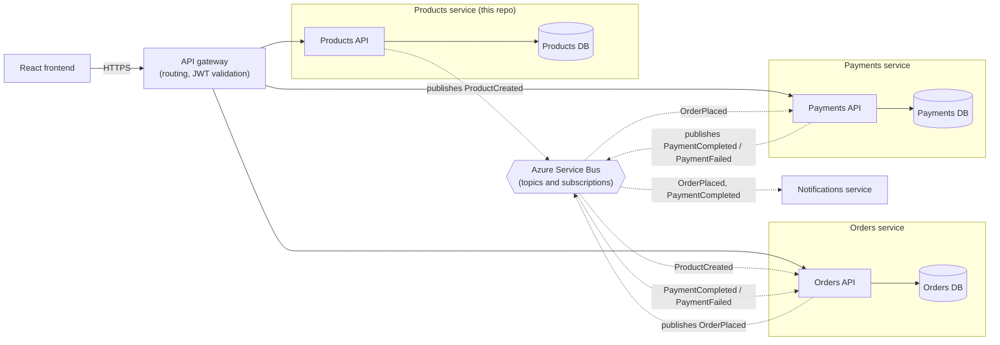

# ProductService

A production-grade **Products Web API** built on **.NET 8** following Clean Architecture principles, with a React + TypeScript frontend.

## Architecture

The solution is structured across four layers with a strict inward dependency rule:

```
ProductService/
├── backend/
│   ├── ProductService.Domain/          # Entities, value objects, domain events, repository interfaces
│   ├── ProductService.Application/     # CQRS handlers, DTOs, validation, pipeline behaviours
│   ├── ProductService.Infrastructure/  # EF Core, JWT auth, Azure Service Bus adapter
│   └── ProductService.API/             # Controllers, middleware, health checks, OpenAPI
├── frontend/                           # React 18 + TypeScript + Vite
├── tests/
│   ├── ProductService.UnitTests/
│   └── ProductService.IntegrationTests/
├── docker-compose.yml
└── ProductService.sln
```

### In a wider event-driven system

This repository contains only the Products service. The diagram below shows how it could sit alongside other services (Orders, Payments and Notifications are illustrative and not part of this repo). Each service owns its own database and they communicate asynchronously through Azure Service Bus rather than calling each other directly.



Solid arrows are synchronous HTTP calls; dotted arrows are asynchronous events.

- **Products** publishes `ProductCreated` when a product is saved (the `ProductCreatedDomainEvent` already raised by this service).
- **Orders** subscribes to `ProductCreated` to keep its own read-only copy of product data, so it can accept orders without calling Products. It publishes `OrderPlaced`.
- **Payments** reacts to `OrderPlaced`, takes payment, and publishes `PaymentCompleted` or `PaymentFailed`, which Orders uses to confirm or cancel the order.
- **Notifications** listens to order and payment events to email the customer; it can be added or removed without changing any publisher.

## API Endpoints

| Method | Path | Auth | Description |
|--------|------|------|-------------|
| GET | `/health` | None | Health check |
| POST | `/api/auth/token` | None | Obtain JWT (test only) |
| POST | `/api/products` | JWT Bearer | Create a product |
| GET | `/api/products` | JWT Bearer | List all products |
| GET | `/api/products/{id}` | JWT Bearer | Get product by ID |
| GET | `/api/products/by-colour/{colour}` | JWT Bearer | Filter by colour |

Valid colours: `Red`, `Blue`, `Green`, `Yellow`, `Black`, `White`, `Orange`, `Purple`, `Pink`, `Brown`, `Grey`

## Getting Started

### Prerequisites

- [.NET 8 SDK](https://dotnet.microsoft.com/download/dotnet/8)
- [Node.js 22+](https://nodejs.org/)
- [Docker Desktop](https://www.docker.com/products/docker-desktop/)

### Run with Docker Compose

```bash
docker-compose up --build
```

- API: `http://localhost:5197`
- Swagger UI: `http://localhost:5197/swagger`
- Frontend: `http://localhost:5173`

### Run Locally (without Docker)

**Backend:**

```bash
# Restore and build
dotnet restore ProductService.sln
dotnet build ProductService.sln

# Run the API (requires a SQL Server instance — update appsettings.Development.json)
dotnet run --project backend/ProductService.API
```

**Frontend:**

```bash
cd frontend
npm install
npm run dev
```

Set `VITE_API_URL` in a `.env.local` file:

```
VITE_API_URL=http://localhost:5000/api
```

## Configuration

Copy `appsettings.json` values and override via environment variables or user secrets. Key settings:

| Key | Description |
|-----|-------------|
| `ConnectionStrings__DefaultConnection` | SQL Server connection string |
| `Jwt__SecretKey` | Signing key (min 32 chars) — never commit this |
| `Jwt__Issuer` | Token issuer (default: `ProductService`) |
| `Jwt__Audience` | Token audience (default: `ProductServiceClients`) |
| `AzureServiceBus__ConnectionString` | Azure Service Bus for domain event publishing |

> **Note:** `appsettings.Development.json` is gitignored. Use `dotnet user-secrets` or environment variables for local secrets.

## Testing

```bash
# All tests
dotnet test ProductService.sln

# Unit tests only
dotnet test tests/ProductService.UnitTests/ProductService.UnitTests.csproj

# Integration tests only (requires Docker for Testcontainers SQL Server)
dotnet test tests/ProductService.IntegrationTests/ProductService.IntegrationTests.csproj
```

## CI/CD

GitHub Actions workflows:

- **CI** (`ci.yml`) — runs on push/PR to `main` and `develop`: builds backend, runs unit + integration tests, builds and type-checks frontend.
- **CD** (`cd.yml`) — runs on push to `main`: runs EF Core migrations, deploys API to **Azure App Service**, deploys frontend to **Azure Static Web Apps**.

Required GitHub secrets for CD:

| Secret | Description |
|--------|-------------|
| `AZURE_CREDENTIALS` | Azure service principal JSON |
| `AZURE_SQL_CONNECTION_STRING` | Production database connection string |
| `AZURE_STATIC_WEB_APPS_API_TOKEN` | Static Web Apps deployment token |
| `VITE_API_URL` | Production API base URL for the frontend build |

## Tech Stack

**Backend**
- .NET 8, ASP.NET Core, Clean Architecture
- MediatR (CQRS), FluentValidation, Serilog
- Entity Framework Core 8 + SQL Server
- Azure Service Bus via MassTransit
- xUnit, FluentAssertions, NSubstitute, Testcontainers

**Frontend**
- React 18, TypeScript, Vite
- TanStack Query, React Hook Form + Zod
- Axios, Zustand
